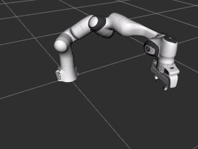
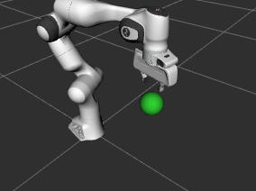
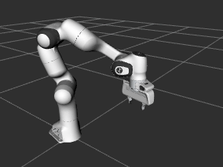

# Programming Tutorial Part 2

Part 2 of the tutorial covers the the use of logical named poses, reference frames, symmetry of poses, and collision avoidance with arm commander package.

## The Named Joint-Space Poses

The program file `named_poses/named_poses_1.py` illustrates the use of logical named poses for robot arm manipulation. The program demonstrates reading logical joint-space pose definitions from a yaml file, install these poses in the arm commander and uses these poses in move commands.

### Adding Named Poses to the Arm Commander

The variable `config_file` specifies the location of the yaml file relative to the path of the example program file.
```
# load config file and install the named poses
try:
    with open(os.path.join(os.path.dirname(__file__), f'{config_file}'), 'r') as f:
        self.demo_config = yaml.safe_load(f)
    for named_pose in self.demo_config['scene']['named_poses'].keys():
        arm_commander.add_named_pose(named_pose, self.demo_config['scene']['named_poses'][named_pose])
except:
    logger.error(f'Error in loading demo config file {config_file}')
    raise
```
The yaml file has defined two named joint-space poses, namely, `stow` and `home`.
```
robot: panda
moveit_group_name: panda_arm
scene:
  named_poses: 
    stow: [0.0, -1.244, 0.0, -2.949, 0.0, 1.704, 0.785] # from base
    home: [0.0, -0.785, 0.0, -2.36, 0.0, 1.57, 0.785] # from base
```

### Move to Named Poses

```
arm_commander.wait_for_ready_to_move()

# send a move command to 'stow'
logger.info(f'Move_to_named_pose: stow')
arm_commander.move_to_named_pose('stow', wait=True)
arm_commander.reset_state()

# send a move command to 'home'
logger.info(f'Move_to_named_pose: home')
arm_commander.move_to_named_pose('home', wait=True)
arm_commander.reset_state()
```

## Movement According to Different Reference Frames

Robot manipulation can use the world's frame and other reference frames for movement definitions. The API of the arm commander has made the use of different reference frames programmatically simple. It offers functions to define custom reference frames through adding collision objects. Most of the move functions offers an optional parameter to change the reference frame to a custom one.

### Adding Collision Objects as Anchors of Reference Frames and Move Based on a Custom Reference Frames

The example program `/framemove/frame_move_1.py` defines a box and use the box's position [0.5, 0.2, 0.2] and orientation [0, 0, 0] to define a reference frame.

```
arm_commander.add_box_to_scene('area_1', [0.4, 0.2, 0.01], xyz=[0.5, 0.2, 0.2], rpy=[0, 0, 0])
```
- The name of the object is the name of the reference frame, and in this case it is `area_1`.
- The dimension of the box is [0.4, 0.2, 0.01].
- The position of the box is [0.5, 0.2, 0.2].
- The orientation of the box is [0, 0, 0]

The following snippet first moves to the origin [0.0, 0.0] of `area_1`, and then to the two opposite corners ([-0.2, -0.1] and [0.2 and 0.1]) of the the box.
```
# send a move command to a position in the frame of area_1
arm_commander.move_to_position(x = 0.0, y = 0.0, z = 0.15, wait=True, reference_frame='area_1')
arm_commander.reset_state()
# send a move command to a position in the frame of area_1
arm_commander.move_to_position(x = -0.2, y = -0.1, z = 0.15, wait=True, reference_frame='area_1')
arm_commander.reset_state()      
# send a move command to a position in the frame of area_1
arm_commander.move_to_position(x = 0.2, y = 0.1, z = 0.15, wait=True, reference_frame='area_1')
arm_commander.reset_state()  
```


### Exploiting Symmetry in Movement with Multiple Reference Frames

The support for defining custom reference frames enables the division of the world into semantically rich subspaces. Movements defined relative to the origin and orientation of the subspace are more understandable to programmers, more reusable, and more resilience to changes. 

For example, a set of movements defined in related to a workbench can be reused on workbenches in another location. The reference frame supports 

The following defines two __areas__ at different position and of a different orientation.

```
arm_commander.add_box_to_scene('area_1', [0.4, 0.2, 0.01], xyz=[0.5, 0.2, 0.2], rpy=[0, 0, 0])
arm_commander.add_box_to_scene('area_2', [0.4, 0.2, 0.01], xyz=[0.5, -0.2, 0.1], rpy=[0, 0, 1.57])     

```
The same movement commands can be used to produce the same relative movements within the two areas by specifying the reference frames.
```
# send a move command to a position in the frame of area_1
arm_commander.move_to_position(x = 0.0, y = 0.0, z = 0.15, wait=True, reference_frame='area_1')
arm_commander.reset_state()
# send a move command to the same relative position but in the frame of area_2
arm_commander.move_to_position(x = 0.0, y = 0.0, z = 0.15, wait=True, reference_frame='area_2')
arm_commander.reset_state()        

# send a move command to a position in the frame of area_1
arm_commander.move_to_position(x = -0.2, y = -0.1, z = 0.15, wait=True, reference_frame='area_1')
arm_commander.reset_state()      
# send a move command to the same relative position but in the frame of area_2       
arm_commander.move_to_position(x = -0.2, y = -0.1, z = 0.15, wait=True, reference_frame='area_2')
arm_commander.reset_state()   
```


## A Summary of Move Functions

The following table summarizes the support provided by each of the move functions. `Yes` indicates the parameter is supported.

| Name | Move Parameter | Cartesian | Reference Frame | Wait |
| --- | --- | --- | --- | --- |
| move_to_named_pose | named_pose |  |  | Yes |
| move_displacement | dx, dy, dz |  |  | Yes |
| move_to_position | x, y, z | Yes | Yes | Yes |
| rotate_to_orientation | roll, pitch, yaw | | Yes | Yes |
| move_to_pose | Pose, PoseStamped or list |   | Yes | Yes |

## Workspace, Collision Avoidance, and Constraints

### Define a workspace

A workspace can be defined in the arm commander for confining arm movements within a 3D bounding box. Internally, the workspace is constructed by 6 box-shaped collision objects, one on each of the 6 sides.
The following snipped can be found in the program file `/collision/workspace.py`
```
# add the workspace as a bounding box of xmin, ymin, zmin, zmax, ymax, zmax
workspace_bbox = [-0.4, -0.3, -0.2, 0.6, +0.3, 0.8]
arm_commander.set_workspace_walls(*workspace_bbox)
```
The workspace appears as a semi-transparent purple box in RViz. Move commands that result in any part of the robot arm infringing the workspace limits are aborted and a `TIMED_OUT` error is returned.
```
# move within the workspace
arm_commander.move_to_position(x = 0.3, y = -0.1, z = 0.3, wait=True)
arm_commander.reset_state()
# move outside the workspace
arm_commander.move_to_position(y = 0.35, wait=True)
arm_commander.reset_state()
```

## Collision Avoidance

Avoidance of collision is supported by path planning of the underlying robot manipulation platform such as Moveit. 
The program file `/collision/avoid_object.py` illustrates how the end-effector of the robot arm moves to the side and the top of a collision object.



## Constraints

The program file `/collision/avoid_object_fix_rotation.py` illustrates the use of `OrientationConstraint`.

```
arm_commander.add_path_constraints(moveit_tools.create_path_orientation_constraint(arm_commander.get_end_effector_link(), 
                arm_commander.pose_in_frame(), 0.01, 6.28, 0.01))

# move to the opposite side of the object
xyzrpy = [0.4, 0.15, 0.4, 3.14, 0.0, 0.6]
arm_commander.move_to_pose(xyzrpy, wait=True)
arm_commander.reset_state()         

# move to the top of the object
xyzrpy = [0.4, 0.0, 0.6, 3.14, 0.0, 0.6]
arm_commander.move_to_pose(xyzrpy, wait=True)
arm_commander.reset_state()    
```


Another `OrientationConstraint` has been commented out, try using it to replace the current one and observe the difference.

The program file `/collision/avoid_object_fix_region.py` illustrates the use of two different `PositionConstraint` objects. The first one allows the end-effector to pass over the object.
```
# add an positional path constraint to restrict the end-effector to move within the bbox below, which is the nearer side of the object
allowed_bbox = [0.1, -0.3, 0.3, 0.5, +0.3, 0.6]
arm_commander.add_path_constraints(moveit_tools.create_position_constraint_from_bbox(arm_commander.get_end_effector_link(), 
            arm_commander.get_world_reference_frame(), allowed_bbox))

# move to the opposite side of the object
xyzrpy = [0.4, 0.15, 0.4, 3.14, 0.0, 0.6]
arm_commander.move_to_pose(xyzrpy, wait=True)
arm_commander.reset_state() 
```

The second one allows the end-effector to move in front of the object.
```
# clear the current positional path constraint and add another positional path constraint
# to restrict the end-effector to move within the bbox below, which is the outer side of the object
arm_commander.clear_path_constraints()   
allowed_bbox = [0.3, -0.3, 0.3, 0.8, +0.3, 0.6]
arm_commander.add_path_constraints(moveit_tools.create_position_constraint_from_bbox(arm_commander.get_end_effector_link(), 
            arm_commander.get_world_reference_frame(), allowed_bbox))           

# move to above the object
xyzrpy = [0.4, -0.15, 0.4, 3.14, 0.0, 0.6]
arm_commander.move_to_pose(xyzrpy, wait=True)
arm_commander.reset_state() 
```


### References

- [Programming Tutorial Part 1](TUTORIAL_PART1.md)

### Author

Dr Andrew Lui, Senior Research Engineer <br />
Robotics and Autonomous Systems, Research Engineering Facility <br />
Research Infrastructure <br />
Queensland University of Technology <br />

Latest update: Feb 2024
